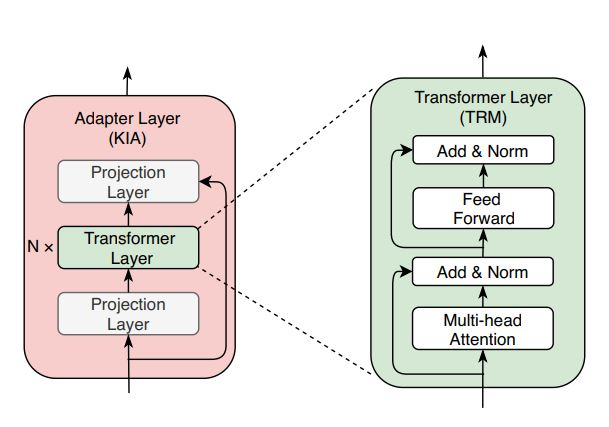

# paper list

1. **K-BERT: Enabling Language Representation with Knowledge Graph** *AAAI2020 (Liu, Zhou et al. 2019)* [paper](https://arxiv.org/abs/1909.07606), [code](https://github.com/autoliuweijie/K-BERT)
2. **Knowledge enhanced contextual word representations** *EMNLP2019 (Peters, Neumann et al. 2019)* [paper](https://arxiv.org/abs/1909.04164), [code](https://github.com/allenai/kb)
3. **KEPLER: A Unified Model for Knowledge Embedding and Pre-trained Language Representation** *arXiv2019 (Wang, Gao et al. 2019)* [paper](https://arxiv.org/abs/1911.06136)
4. **Enriching BERT with Knowledge Graph Embeddings for Document Classification** *arXiv2019 (Ostendorff, Bourgonje et al. 2019)* [paper](https://arxiv.org/abs/1909.08402), [code](https://github.com/malteos/pytorch-bert-document-classification)
5. **ERNIE: Enhanced Language Representation with Informative Entities** *ACL2019 (Zhang, Han et al. 2019)* [paper](https://arxiv.org/abs/1905.07129), [code](https://github.com/thunlp/ERNIE)
6. **ERNIE: Enhanced Representation through Knowledge Integration** *ACL2019 (Sun, Wang et al. 2019)* [paper](https://arxiv.org/abs/1904.09223), [code](https://github.com/PaddlePaddle/ERNIE)
7. **Integrating Graph Contextualized Knowledge into Pre-trained Language Models** *arXiv2019 (He, Zhou et al. 2019)* [paper](https://arxiv.org/abs/1912.00147)
8. **PRETRAINED ENCYCLOPEDIA: WEAKLY SUPERVISED KNOWLEDGE-PRETRAINED LANGUAGE MODEL** *ICLR2020 (Xiong, Du et al. 2019)* [paper](https://arxiv.org/abs/1912.09637)
9. **Specializing Unsupervised Pretraining Models for Word-Level Semantic Similarity** *(Lauscher, Vulic et al. 2020)* [paper](https://arxiv.org/abs/1909.02339)
10. **SenseBERT: Driving Some Sense into BERT** *arXiv2020 (Levine, Lenz et al. 2019)* [paper](https://arxiv.org/abs/1908.05646)
11. **K-ADAPTER: Infusing Knowledge into Pre-Trained Models with Adapters** *arXiv2020 (Wang, Tang et al. 2020)* [paper](https://arxiv.org/abs/2002.01808)
12. **Pre-trained Models for Natural Language Processing: A Survey** *arXiv2020 (Qiu, Sun et al. 2020)* *4.1 Knowledge-Enriched PTMs* [paper](https://arxiv.org/abs/2003.08271)
13. **SciBERT: A Pretrained Language Model for Scientific Text** *EMNLP2019 (Beltagy, Lo et al. 2019)* [paper](https://arxiv.org/abs/1903.10676), [code](https://github.com/allenai/scibert/)
14. **BioBERT: a pre-trained biomedical language representation model for biomedical text mining** *arXiv2019 (Lee, Yoon et al. 2020)*  [paper](https://arxiv.org/abs/1901.08746), [code](https://github.com/dmis-lab/biobert), [model](https://github.com/naver/biobert-pretrained)
15. **Don’t Stop Pretraining: Adapt Language Models to Domains and Tasks** *ACL2020 (Gururangan, Marasović et al. 2020)* [paper](https://arxiv.org/abs/2004.10964), [code](https://github.com/allenai/dont-stop-pretraining) 

---
TODO

* DeBERTa: Decoding-enhanced BERT with Disentangled Attention *arXiv2020 (He, Liu et al. 2020)* [paper](https://arxiv.org/abs/2006.03654), [code](https://github.com/microsoft/DeBERTa)
* StructBERT: Incorporating Language Structures into Pre-training for Deep Language Understanding *ICLR2020 (Wang, Bi et al. 2020)* [paper](https://openreview.net/forum?spm=ata.13261165.0.0.70ad797aLr6IZC&id=BJgQ4lSFPH)
* Symmetric Regularization based BERT for Pair-wise Semantic Reasoning *arXiv2019 (Xu, Cheng et al. 2019)* [paper](https://arxiv.org/abs/1909.03405)
* SKEP: Sentiment Knowledge Enhanced Pre-training for Sentiment Analysis *ACL2020 (Tian, Gao et al. 2020)* [paper](https://arxiv.org/abs/2005.05635)
* Barack’s Wife Hillary: Using Knowledge Graphs for Fact-Aware Language Modeling *ACL2019 (Logan, Liu et al. 2019)* [paper](https://www.aclweb.org/anthology/P19-1598/), [code](https://github.com/rloganiv/kglm-model)
---

# paper summary

| Model | Knowledge | Objective | BERT Train |
| ----- | :-------: | :-------: | :-------:  |
| 1. K-BERT(Liu, Zhou et al. 2019) | CNDBpedia, HowNet,MedicalKG |扩展BERT结构，引入三元组知识 |可以复用BERT参数，KG在fine-tune阶段加入 |
| 2. KnowBERT(Peters, Neumann et al. 2019) | Wikipedia,WordNet |联合训练BERT和实体链接任务 | 模块嵌入在BERT之中进行训练 |
| 3. KEPLER(Wang, Gao et al. 2019) | Wikipedia,WikiData |KG embedding和MLM联合学习 |使用RoBERTa初始化模型参数，再进行联合学习 |
| 4. BERT+KG embedding(Doc classifier)(Ostendorff, Bourgonje et al. 2019) | WikiData |BERT+KG Emb，文本分类 |Fine-tune |
| 5. ERNIE(THU)(Zhang, Han et al. 2019) | Wikipedia,WikiData |将entity embedding(TransE)和文本对齐，加入到模型中进行训练 |原有BERT训练任务基础上mask一些entity |
| 6. ERNIE(Baidu)(Sun, Wang et al. 2019) | Chinese Wikipedia, Baidu Baike, Baidu news, Baidu Tieba |通过mask短语和实体，迫使语言模型学习实体信息 |沿用BERT训练方式 |
| 7. BERT-MK(He, Zhou et al. 2019) | Unified Medical Language System |与ERNIE(THU)相同，修改了entity embedding的方式 |使用PubMed corpus对BERT Base fine-tune |
| 8. WKLM(Xiong, Du et al. 2019) | Wikipedia,WikiData |在BERT的基础上使用替换策略，将实体替换为同类型其他实体，并做二分类 |使用BERT初始化模型，降低实体的mask比率 |
| 9. LIBERT(Lauscher, Vulic et al. 2020) | WordNet |增加上下位词/同义词判断任务 |结合新任务from scratch训练 |
| 10. SenseBERT(Levine, Lenz et al. 2019) | WordNet |在masked word的基础上加入对WordNet中supersense的预测 |结合新任务from scratch训练 |
| 11. K-Adapter(Wang, Tang et al. 2020) | Wikipedia,Wikidata, Dependency parser |扩展BERT结构，通过关系分类任务加入fact知识，通过依存关系父节点预测加入linguistic知识 |在RoBERTa基础上对Adapter训练，以支持下游任务 |
| 12. PTMs Survey | - | - | - |
| 13. SCIBERT(Beltagy, Lo et al. 2019) | Scientific Text,外部词典 |直接换scientific语料训练，并扩充词典 |新语料from scratch训练 |
| 14. BioBERT(Lee, Yoon et al. 2020) | biomedical语料和词典 |continue BERT train |continue BERT train |
| 15. Pretraining(Gururangan et al. 2020) | - | - | - |

# paper details

### K-BERT: Enabling Language Representation with Knowledge Graph(Liu, Zhou et al. 2019)
(AAAI2020) [代码](https://github.com/autoliuweijie/K-BERT) [论文](https://arxiv.org/abs/1909.07606)

**摘要**

1.	为预训练语言模型（bert）引入领域知识（注入三元组）
2.	过量的知识可能使句子偏离原始语义（knowledge noise issue），本文使用soft-position和visible matrix进行约束
3.	K-bert可以方便的把领域知识注入预训练的bert中，适合有知识驱动的领域问题（注入过程不需要基于领域知识进行预训练过程）

**模型结构**

Knowledge layer抽取knowledge graph中的知识扩充句子得到sentence tree，sentence tree 展开成序列，并把tree中的token到句首的距离作为soft position，对序列进行embedding的过程中加入该soft position。
seeing layer通过控制sentence tree中的token是否可见（在一个mask-self-attention block中，sentence tree中不同分支的token互相不可见，且扩展的知识对于`[CLS]`不可见），避免knowledge noise问题。

**Challenge与解决方法**

1. 文本和知识之间异构的向量空间
    * 把三元组插入句子中，作为句子的一部分（sentence tree->sequence）
    * soft-position来解决sentence tree转成sequence过程中的顺序编码
    * 其余和原始bert保持不变
2. Knowledge noise，过多的知识会使句子偏离原始语义（seeing layer）
    * sentence tree中不同分支的token互相不可见，且扩展知识和`[CLS]`也互相不可见
    * token与它扩展的知识在同一个分支，所以互相可见，该token融合了知识的信息会传递到下一层mask-self-attention block
    * 这样即融入了entity信息，也避免了过多的知识会使句子语义偏移

**小结**

* 亮点1：加入知识的过程是在已训练好的bert基础上进行的，不需要从头到尾在新加入知识的数据上重新训练。
* 亮点2：visible matrix很好的实现了：在引入knowledge的同时，避免knowledge使句子语义发生偏移
* 不足1：soft-position只是缓解了把sentence tree转化为sequence过程中结构信息的丢失。
* 不足2：没有对关联的三元组进行筛选，一词多义现象会引入噪音。另一方面，BERT级别的模型已经通过大量语料“学到”了、一些常见或者高频的潜在知识，这部分内容再显式的加进去是没有明显效果的。而且因为目前知识的选择相对简单，很容易将错误的信息作为知识带入，因此反而可能会带来负面的影响。
    > 举个例子 “天安门，位于，北京”这个三元组对于K-BERT的作用很小，因为“天安门”和“北京”在大规模预料中经常会共同出现，因此这两个词的embedding特别接近。而“阿斯匹林，减缓，肺内流“这种专业领域的知识，在大规模预料中很少共同出现，这类知识是对K-BERT有效的。

### Knowledge enhanced contextual word representations(Peters, Neumann et al. 2019)
(EMNLP2019) [代码](https://github.com/allenai/kb), [论文](https://arxiv.org/abs/1909.04164)

**摘要**

1.	本文提出了一种通用的方法(KAR)，能够将多个知识图谱加入到预训练的语言模型中（加在BERT不同的Transformer-block之间）。
2.	该方法首先在文本中识别entity，并利用知识图谱中相关实体的embedding对识别出的entity span表示进行增强，然后借助于word-to-entity attention获取每个word此时的上下文信息(Transformer)。
3.	本文的模型KnowBert与BERT兼容，对下游任务友好；KAR参数很少，能够方便的处理新加入的知识图谱。
4.	这里的entity识别模块会和语言模型一起训练，实现端到端的多任务联合学习。

**模型结构**

KAR是插入在BERT内部层之间的。模型的输入是上一层BERT(Transformer block)的输出。图中的步骤为（与标号对应）：
1. 对上一层BERT(Transformer block)的输出做线性变换，维度和entity embedding保持一致
2. 使用pooling进行共指消解，得到之后的句子中每个mention的表示S
3. 通过multi-head attention，获取全局信息，得到每个mention的表示Se
4. 实体链接器，根据候选实体的embedding和mention编码的内积对候选实体打分，将分数作为权重，对候选实体embedding进行加权求和得实体embedding
5. 将Se和实体embedding进行相加得S’e，对mention的word表示进行增强
6. Attention(H^project, S’e, S’e)，执行Transformer编码过程

**小结**

本文通过把BERT与实体链接模型进行联合训练，以端到端的方式集成了实体的相关信息。联合学习过程虽然可以引入实体的信息，但相应的，也会依赖实体链接组件，带来额外的开销与错误，并且不易推广到广义的结构化知识。

### KEPLER: A Unified Model for Knowledge Embedding and Pre-trained Language Representation(Wang, Gao et al. 2019)

(arXiv2019) [论文](https://arxiv.org/abs/1911.06136)

**摘要**
1.	本文提出了语言模型与知识表示学习联合训练模型，使得语言模型能够受益于知识增强，知识表示能够受益于文本信息。
2.	利用语言模型编码实体的描述信息作为实体的embedding，同时优化语言模型和知识表示学习模型。

**模型结构**

本文的语言模型与知识表示学习模型仅在实体的描述信息编码过程中有交集，训练任务中的knowledge embedding和masked language model独立。其中KE loss沿用了TransE中的loss，MLM loss沿用了语言模型中的交叉熵损失函数。模型并没有从头开始训练，而是使用RoBERTa进行初始化，然后以KE和MLM为目标进行联合调优。

**小结**

本文方法本质上是多任务学习，对Knowledge embedding和Masked language model同时学习。但执行过程，更多的是语言模型为knowledge embedding任务进行增强，而knowledge embedding任务对语言模型的没有直接的提供帮助。

### Enriching BERT with Knowledge Graph Embeddings for Document Classification(Ostendorff, Bourgonje et al. 2019)

(arXiv2019) [代码](https://github.com/malteos/pytorch-bert-document-classification), [论文](https://arxiv.org/abs/1909.08402)

**模型结构**

对书本进行分类。
1.	书的描述文本使用BERT编码
2.	书的作者信息通过在wikidata graph进行表示学习得到embedding（使用pytorch-BigGraph进行表示学习，可选训练TransE,ComplEx等模型）
3.	特征信息简单拼接，直接分类。

### ERNIE: Enhanced Language Representation with Informative Entities(Zhang, Han et al. 2019)

(ACL2019) [代码](https://github.com/thunlp/ERNIE), [论文](https://arxiv.org/abs/1905.07129)

**摘要**

1.	知识图谱包含了大量的结构化的知识(entities, fact triples)，能够为语言模型的学习提供帮助
2.	本文提出一种知识增强语言模型，能够同时考虑词法，句法，以及外部知识；提升了knowledge-drive任务的效果。

**模型结构**

本文提出的知识增强语言模型，可以分为两个阶段。

第一阶段：
利用T-Encoder对文本进行编码，T-Encoder沿用了BERT的模型结构（本文中，T-Encoder使用的Transformer layer数量N=6）
利用TransE对knowledge graph中的实体进行编码。

第二阶段：
利用K-Encoder对文本编码、实体编码进行融合。融合过程在线性变换之后直接加。（本文中K-Encoder使用的Aggregator layer数量M=6）

**Challenge和解决方法**

1.	结构化知识的编码
        1. 文本相关结构化知识的获取 首先进行实体链接（by TAGME）,把实体信息作为knowledge引入预训练语言模型
        2. 结构化知识的表示 利用TransE对实体进行编码（保留KG结构信息），并作为K-Encoder输入中的实体部分
2.	异构信息融合
        1. 融合过程 首先通过multi-head attention处理上一层aggregator的结果。若当前token有对应实体，则将实体编码线性变换的结果与token编码线性变换的结果直接相加进行融合(通过非线性激活函数GELU)，并送入下一层aggregator。如果token无对应实体，则省略相加过程。
        2. 训练任务 随机的mask一些token对应的entity，并要求系统去预测这些token对应的entity（基于上下文）。

**小结**

本文借鉴了BERT预训练模型的思路来构建ERNIE模型，可以简单看为BERT+TransE的预训练模型。ERNIE模型是针对通用领域的知识增强预训练语言模型。该方法的效果要以大量的knowledge graph数据为前提。

### ERNIE: Enhanced Representation through Knowledge Integration(Sun, Wang et al. 2019)

(ACL2019) [代码](https://github.com/PaddlePaddle/ERNIE), [论文](https://arxiv.org/abs/1904.09223)

**摘要**
1.	ERNIE在BERT的基础上，通过knowledge mask机制实现对语言模型的增强。Knowledge mask机制包含entity-level masking和phrase-level masking两个方面。

**模型结构**

BERT中原有的masking方式可能会把一个连续的词的一部分给mask掉，这样丢失了词语的含义，也无法学到实体相关的知识。为了引入知识，文章通过三种mask进行预训练：

1. 基本的masking，与BERT类似，随机mask15%的字，来获取词的基本表达。
2. 短语的masking，利用分词工具组字成词，对整个词语/短语进行建模(后期的BERT-wwm借鉴了这个思想)
3. 实体的masking，实体会包含很多重要信息

ERNIE集成了多种异构语料进行训练。

**小结**

ERNIE和BERT的关联非常强，简单的通过masking机制，把短语和实体信息引入预训练的过程。以此来实现对实体信息的关注。
方法简单，效果比较明显，依赖大规模语料，只能提升对实体信息的关注，不能引入更复杂的结构化知识。
(ERNIE2.0是一个通过多任务增量学习的预训练学习框架，和knowledge+BERT关系不大)

### Integrating Graph Contextualized Knowledge into Pre-trained Language Models(He, Zhou et al. 2019)

(arXiv2019) [论文](https://arxiv.org/abs/1912.00147)

**摘要**

1.	提出一种基于Transformer的知识表示学习算法
2.	编码后的实体加入到BERT中，进行知识增强

**模型结构**

本文提出的知识增强语言模型和THU-ERNIE非常相似，融合过程几乎一致。这里最大的区别是THU-ERNIE中利用TransE来得到实体的embedding，而本文设计了一种基于Transformer的知识表示学习算法。

**小结**

本文可以看作THU-ERNIE中把知识表示学习算法从TransE换成KG-Transformer(利用Transformer做知识表示学习)。这个工作并没有太大的创新，且TransE无监督训练具有天然的优势，实验结果中使用TransE也的效果也没有差太多。

### PRETRAINED ENCYCLOPEDIA: WEAKLY SUPERVISED KNOWLEDGE-PRETRAINED LANGUAGE MODEL(Xiong, Du et al. 2019)

(ICLR2020) [论文](https://arxiv.org/abs/1912.09637)

**摘要**

1. 提出弱监督训练方法将knowledge(real-world entities)编码到预训练模型中
2. 完善事实补全任务，测试预训练模型的能力
3. 针对entities-related QA，本文中基于knowledge的模型很有效

**模型结构**

本文提出了一种关注entity的bert训练方法，没有从模型层面对bert进行修改，只在数据，任务，训练这几个方面做了调整。
1. Data preparation 本文中的训练使用了wikidata数据，根据锚文本和实体别名识别实体。
2. 替换策略 给定wikidata的文本，把原始文本作为knowledge statements的正例，并通过将文本中的entity替换成同类别的其他entity作为负例（不会连续替换两个实体）。把entity所在的文本作为上下文。
3. Bert架构 本文使用了与BERT base相同的模型结构，并根据每个entity的上下文(boundary words)做二分类判断：该entity是否被替换过。
4. 训练目标 在判断entity是否被替换的同时，也使用了masked language model，这里只对非entity的词汇进行mask，并将mask的比例从原来的15%调低至5%

**小结**

本文是一个结合了实体信息的预训练语言模型。沿用了原始的BERT模型，对训练任务做出了调整，加入对替换的同类别实体的判断过程，从而达到学习实体信息的目的。训练数据集主要针对大语料的数据集（这种数据集并不多），对于通用型的entity相关任务（QA任务，事实补全）可以超越传统BERT，没有对领域化知识处理的处理方法。

### Specializing Unsupervised Pretraining Models for Word-Level Semantic Similarity(Lauscher, Vulic et al. 2020)
(arXiv2020) [论文](https://arxiv.org/abs/1909.02339)

**摘要**

1.	为BERT加入了词法知识

**模型结构**

本文在BERT的MLM和NSP的任务基础上增加了一个任务：linguistic constraint prediction，即二分类判断词对的关系。词对的训练样本通过以下方式获得：
1. 从WordNet，Roget’s Thesaurus中获得同义词对，上下位词对，这些词对都是正例
2. 利用word2vec/fasttext训练静态词向量，把距离近的，且不属于正例的词对作为负例。
3. 词对直接作为BERT的`[SEP]`分开的两句话，送入模型

**小结**

本文的方法是一个结合了对同义词，上下位词预测的多任务联合学习模型。相当于引入了词法知识，这种知识是语义理解层面的知识，不是特定领域下的知识，而且为引入词法知识构建的训练样本比原始文本短很多，这样对模型的影响文中没有说明。

### SenseBERT: Driving Some Sense into BERT(Levine, Lenz et al. 2019)
(arXiv2020) [论文](https://arxiv.org/abs/1908.05646)

**模型结构**

模型在预测masked word的基础上，加入了对supersense的预测，supersense是每个词在WordNet中被定义的“细粒度POS”。

**小结**

本文是一个引入词法信息的多任务学习模型，比较方便的一点是WordNet中的supersense可以直接作为训练数据引入。

### K-ADAPTER: Infusing Knowledge into Pre-Trained Models with Adapters(Wang, Tang et al. 2020)
(arXiv2020) [论文](https://arxiv.org/abs/2002.01808)
	
**摘要**

1. 把知识加入到预训练语言模型中是有必要的，当前预训练语言模型中加入知识的方式多是通过multi-task修改预训练语言模型中的参数。当融合多种知识时，不仅代价很大，而且容易遗忘已经学习过的知识。
2. 本文提出了一个Adapter-based模型，可插拔式的为预训练语言模型加入知识，且不改变原始语言模型(本文使用RoBERTa)的参数。
3. 本文使用了两种Adapter引入知识：事实Adapter（三元组），语言Adapter（依存句法）

**模型结构**

当前通过multi-task方式融合多种知识的过程被改为并行的Adapter方式，不同的Adapter获取不同类型的知识。每个adapter最后的输出会和语言模型最后的输出拼接作为该knowledge task的输出。如果同时融合多种knowledge，就把这些knowledge task输出简单拼接。Adapter和语言模型之间是平行操作的。

Adapter的实现方式有很多种，本文设计了一种支持插拔的knowledge-specific adapter结构，该Adapter由两个projection layer和N个Transformer构成（本文N=2）。Adapter不会在预训练语言模型的每一层插入，本文只在RoBERTa的0，11，23层后面加入了Adapter-layer层。

本文中，事实adapter训练关系分类任务，通过判断三元组中entity是否存在相应关系来学习关系的知识；语言adapter通过预测依存关系中父节点的位置，引入依存语义知识。在引入知识的过程中，对预训练语言模型的参数进行freeze，只学习知识相关的参数；在下游任务中应用时，预训练语言模型依然采用fine-tune方式，不对参数进行freeze。

**小结**

本文为预训练引入知识提供了灵活的解决方案，adapter-base的结构可以在原有的预训练语言模型的基础上添加各种类型的知识，adapter的模型结构修改也比较方便，训练仅对adapter的参数进行。

### Pre-trained Models for Natural Language Processing: A Survey(Qiu, Sun et al. 2020)
(arXiv2020) [论文](https://arxiv.org/abs/2003.08271)

**小结**

关于PTMs的综述，4.1 Knowledge-Enriched PTMs

### SCIBERT: A Pretrained Language Model for Scientific Text(Beltagy, Lo et al. 2019)
(EMNLP2019) [代码](https://github.com/allenai/scibert/) [论文](https://arxiv.org/abs/1903.10676)

**摘要**

1.	使用1.14M papers(from Semantic Scholar)，一共约3.17B tokens(和google bert用的语料规模基本一致)。模型结构直接使用BERT，from scratch训练BERT模型。
2.	加入外部词典
（细节：直接训练长句子会非常的慢，本文首先设置max_length=128 tokens，训练到loss停止下降，再训练能够处理长句子的模型(512tokens)）

### BioBERT: a pre-trained biomedical language representation model for biomedical text mining(Lee, Yoon et al. 2020)
(arXiv2019) [代码](https://github.com/dmis-lab/biobert), [论文](https://arxiv.org/abs/1901.08746), [预训练模型](https://github.com/naver/biobert-pretrained)

**摘要**

1. 使用biomedical语料Pretrain BERT模型（使用google bert进行BERT参数初始化）
2. 加入biomedical词典

### Don’t Stop Pretraining: Adapt Language Models to Domains and Tasks(Gururangan, Marasović et al. 2020)
(ACL2020) [代码](https://github.com/allenai/dont-stop-pretraining), [论文](https://arxiv.org/abs/2004.10964)

**摘要**
1. Domain-Adaptive Pretraining: 在所属领域（医疗，电商）语料数据上继续预训练
2. Task-Adaptive Pretraining: 在具体任务相关语料上继续预训练

**经验型结论**
1. Domain-Adaptive Pretraining: 在相关领域的语料上继续预训练能够提高任务性能（不相关的领域语料还会降低性能）
2. Task-Adaptive Pretraining: 在领域语料预训练的基础上进行任务语料的预训练，能够进一步提升性能；但是相同领域，不同任务的数据分布并不相同，不能够进行任务级别的迁移。
3. Task-Adaptive Pretraining: 可以通过人工构造或KNN方法扩充任务相关语料，通过任务相关的预训练方式来提升模型效果。

# Blog

1. [美团BERT的探索和实践](https://tech.meituan.com/2019/11/14/nlp-bert-practice.html)